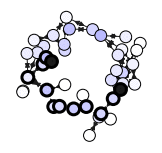
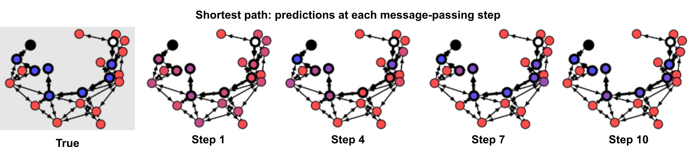
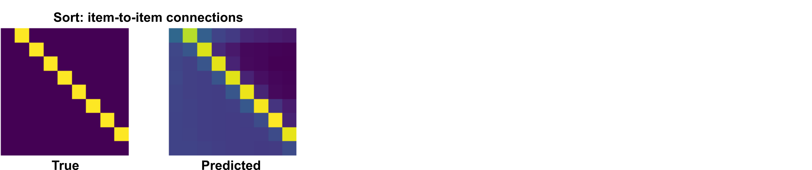
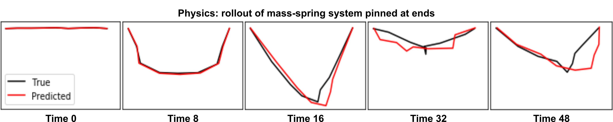

# Graph Nets library

[Graph Nets](https://github.com/deepmind/graph_nets) is DeepMind's library for
building graph networks in Tensorflow and Sonnet.

Contact graph-nets@google.com for comments and questions.

#### What are graph networks?

A graph network takes a graph as input and returns a graph as output. The input
graph has edge- (*E* ), node- (*V* ), and global-level (**u**) attributes. The
output graph has the same structure, but updated attributes. Graph networks are
part of the broader family of "graph neural networks" (Scarselli et al., 2009).

To learn more about graph networks, see our arXiv paper: [Relational inductive
biases, deep learning, and graph networks](https://arxiv.org/abs/1806.01261).


## Installation

The Graph Nets library can be installed from pip.

This installation is compatible with Linux/Mac OS X, and Python 2.7 and 3.4+.

The library will work with both the CPU and GPU version of TensorFlow, but to
allow for that it does not list Tensorflow as a requirement, so you need to
install Tensorflow separately if you haven't already done so.

To install the Graph Nets library for CPU, run:

```shell
$ pip install graph_nets tensorflow tensorflow_probability
```

To install the Graph Nets library for GPU, run:

```shell
$ pip install graph_nets tensorflow_gpu tensorflow_probability_gpu
```

## Usage example

The following code constructs a simple graph net module and connects it to data.

```python
import graph_nets as gn
import sonnet as snt

# Provide your own functions to generate graph-structured data.
input_graphs = get_graphs()

# Create the graph network.
graph_net_module = gn.modules.GraphNetwork(
    edge_model_fn=lambda: snt.nets.MLP([32, 32]),
    node_model_fn=lambda: snt.nets.MLP([32, 32]),
    global_model_fn=lambda: snt.nets.MLP([32, 32]))

# Pass the input graphs to the graph network, and return the output graphs.
output_graphs = graph_net_module(input_graphs)
```

## Demo Jupyter notebooks

The library includes demos which show how to create, manipulate, and
train graph networks to reason about graph-structured data, on a
shortest path-finding task, a sorting task, and a physical prediction task.
Each demo uses the same graph network architecture, which highlights the
flexibility of the approach.

### Try the demos in your browser in [Colaboratory](https://colab.research.google.com)

To try out the demos without installing anything locally, you can run the demos
in your browser (even on your phone) via a cloud Colaboratory backend. Click a
demo link below, and follow the instructions in the notebook.

----------------

#### [Run "shortest path demo" in browser](https://colab.research.google.com/github/deepmind/graph_nets/blob/master/graph_nets/demos/shortest_path.ipynb)

The "shortest path demo" creates random graphs, and trains a graph network to
label the nodes and edges on the shortest path between any two nodes. Over a
sequence of message-passing steps (as depicted by each step's plot), the
model refines its prediction of the shortest path.



----------------

#### [Run "sort demo" in browser](https://colab.research.google.com/github/deepmind/graph_nets/blob/master/graph_nets/demos/sort.ipynb)

The "sort demo" creates lists of random numbers, and trains a graph network to
sort the list. After a sequence of message-passing steps, the model makes an
accurate prediction of which elements (columns in the figure) come next after
each other (rows).



----------------

#### [Run "physics demo" in browser](https://colab.research.google.com/github/deepmind/graph_nets/blob/master/graph_nets/demos/physics.ipynb)

The "physics demo" creates random mass-spring physical systems, and trains a
graph network to predict the state of the system on the next timestep. The
model's next-step predictions can be fed back in as input to create a rollout of
a future trajectory. Each subplot below shows the true and predicted mass-spring
system states over 50 steps. This is similar to the model and experiments in
Battaglia et al. (2016)'s "interaction networks".



----------------

#### [Run "graph nets basics demo" in browser](https://colab.research.google.com/github/deepmind/graph_nets/blob/master/graph_nets/demos/graph_nets_basics.ipynb)

The "graph nets basics demo" is a tutorial containing step by step examples
about how to create and manipulate graphs, how to feed them into
graph networks and how to build custom graph network modules.

----------------

### Run the demos on your local machine

To install the necessary dependencies, run:

```shell
$ pip install jupyter matplotlib scipy
```

To try the demos, run:

```shell
$ cd <path-to-graph-nets-library>/demos
$ jupyter notebook
```
then open a demo through the Jupyter notebook interface.


## Other graph neural network libraries

If you use PyTorch, check out these high-quality open-source libraries for
graph neural networks:

* [pytorch_geometric](https://github.com/rusty1s/pytorch_geometric): See
[MetaLayer](https://rusty1s.github.io/pytorch_geometric/build/html/modules/nn.html#torch_geometric.nn.meta.MetaLayer)
for an analog of our Graph Nets interface.

* [Deep Graph Library (DGL)](https://github.com/dmlc/dgl)
